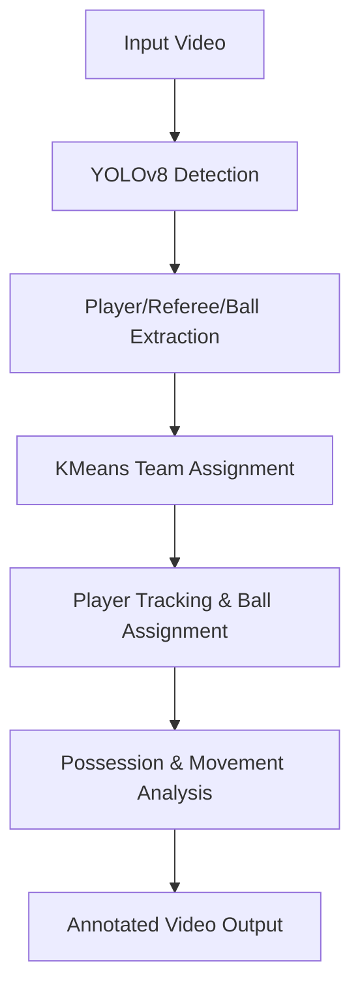

# ⚽ Football Analysis CV

[](https://www.python.org/)
[](https://github.com/ultralytics/ultralytics)
[](https://opencv.org/)


# Video

https://github.com/user-attachments/assets/968f9d57-66e7-4708-8ad0-d169dae06379

## Project Overview

**Football Analysis CV** is an end-to-end computer vision pipeline for analyzing football (soccer) matches from video. It leverages state-of-the-art deep learning (YOLOv8) and clustering (KMeans) to:
- Detect and track players, referees, and the ball
- Assign players to teams based on jersey color
- Track ball possession and active players
- Visualize and quantify player movement in real-world units

<p align="center">
  
  
</p>

---

## Features

- 🎯 **Object Detection**: Detects players, goalkeepers, referees, and the ball using YOLOv8
- 🏳️ **Team Assignment**: Assigns players to teams via KMeans clustering on jersey colors
- 🏃 **Player Tracking**: Maintains player IDs and tracks movement across frames
- ⚽ **Ball Assignment**: Identifies which player has the ball at any moment
- 📊 **Possession Analysis**: Calculates ball possession percentages for each team
- 📏 **Real-World Measurement**: Uses perspective transformation to convert pixel distances to meters
- 🎥 **Annotated Output**: Produces annotated videos with bounding boxes, team colors, and stats

---

## Architecture



---

## Quick Start

### 1. Clone & Install
```bash
git clone https://github.com/yourusername/football-analysis-CV.git
cd football-analysis-CV-main/Pass\ Analysis
pip install -r requirements.txt
```

### 2. Prepare Your Video
- Place your input video in `local_exec/input_video/`
- Edit `local_exec/config/config.py` to set `VIDEO_SRC` and `OUT_VIDEO` paths

### 3. Run the Analysis
```bash
cd local_exec
python main_test.py
```
- Output will be saved in `local_exec/output_video/`

---

## Example Output

- Annotated video with bounding boxes, team colors, player IDs, and ball possession stats
- Sample result:


---

## Tech Stack

- **Python 3.8+**
- [YOLOv8 (Ultralytics)](https://github.com/ultralytics/ultralytics)
- [OpenCV](https://opencv.org/)
- [scikit-learn](https://scikit-learn.org/)
- [supervision](https://github.com/roboflow/supervision)
- [NumPy](https://numpy.org/)
- [matplotlib](https://matplotlib.org/)
- [torch](https://pytorch.org/)

---

## Project Structure

```
Pass Analysis/
├── local_exec/
│   ├── main_test.py         # Main script
│   ├── config/              # Config files
│   ├── utils/               # Utility functions
│   ├── team_assigner/       # Team assignment logic
│   ├── input_video/         # Input videos
│   └── output_video/        # Output videos
├── kaggle_exec/             # Training notebooks
├── requirements.txt         # Dependencies
└── README.md
```

---

## Model Training (Optional)

- Training scripts and notebooks are in `kaggle_exec/`
- Uses Roboflow for dataset management and YOLOv8 for training
- You can retrain the model with your own data for improved accuracy

---

## Challenges & Improvements

**Challenges:**
- Distinguishing players with similar jersey colors
- Detecting small, fast-moving balls
- Tracking players in crowded scenes

**Potential Improvements:**
- Train YOLO on larger, more diverse datasets
- Enhance goalkeeper/team assignment logic
- Explore advanced clustering or deep metric learning for team assignment

---

## Contributing

Contributions are welcome! Please open issues or pull requests for bug fixes, improvements, or new features.

1. Fork the repo
2. Create your feature branch (`git checkout -b feature/YourFeature`)
3. Commit your changes (`git commit -am 'Add new feature'`)
4. Push to the branch (`git push origin feature/YourFeature`)
5. Open a pull request

---

## License

This project is licensed under the MIT License.
